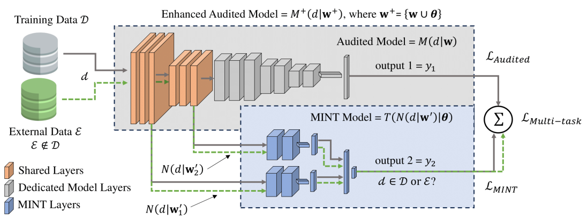

# 📄 Active Membership Inference Test (aMINT): Enhancing Model Auditability with Multi-Task Learning

[](https://arxiv.org/abs/PAPER_ID)

Official repository of the paper:  
**"Active Membership Inference Test (aMINT): Enhancing Model Auditability with Multi-Task Learning"**  
Authors: Daniel DeAlcala, Aythami Morales, Julian Fierrez, Gonzalo Mancera, Ruben Tolosana, and Javier Ortega-Garcia  
📅 Date: July 2025  
🧠 Conference/Journal: Accepted at ICCV

---

## 📝 Abstract

**Active MINT (aMINT)** is a novel method for detecting whether specific data was used during the training of a neural network. Our approach introduces a multi-task training strategy where a secondary model (the MINT Model) is trained alongside the main model to identify training samples . By leveraging intermediate activation maps, aMINT learns to distinguish between seen and unseen data. We evaluate our method across five public datasets and multiple architectures, achieving over **80% accuracy**, significantly surpassing previous methods in Membership Inference. This enhances transparency and strengthens privacy and copyright safeguards in AI.

---

## 🔗 Paper Link

You can read the full paper in **[arXiv here](https://arxiv.org/abs/PAPER_ID)**.

---

## 🚀 How to Run the Code

### 1. Install Dependencies

Our code is based on PyTorch, so the only necessary requirement is to install the corresponding PyTorch dependencies for your system. Specifically, for this work, we used PyTorch version 2.2 with CUDA 12.1:

For CUDA 12.1, use the following command to install dependencies with `conda`:

```bash
conda install pytorch==2.2.2 torchvision==0.17.2 torchaudio==2.2.2 pytorch-cuda=12.1 -c pytorch -c nvidia
```

More information: **[Pytorch Install](https://pytorch.org/get-started/previous-versions/)**

The rest of the libraries are simple to install, and we recommend installing them as needed when running the code.

### 2. Prepare the Data

The datasets used in this work are: **[MNIST](http://yann.lecun.com/exdb/mnist)**, **[CIFAR](https://www.cs.toronto.edu/~kriz/cifar.html)**, **[GSTRB](https://benchmark.ini.rub.de/)**, **[TinyImagenet](https://huggingface.co/datasets/zh-plus/tiny-imagenet)**, and **[CasiaWebFace](https://arxiv.org/abs/1411.7923)**. To use them, simply include the datasets inside a folder called `data/`, and place each dataset in its own folder. For example, `data/MNIST/`.

### 3. Run the Code

To facilitate running the code, we provide the code in Jupyter notebooks. We have created one notebook for each dataset, with the following naming convention: `aMINTMNIST.ipynb`, `aMINTCIFAR.ipynb`, `aMINTGSTRB.ipynb`, `aMINTTinyImagenet.ipynb`, and `aMINTCasiaWebFace.ipynb`. 

By running the corresponding notebook, you can easily train aMINT alongside the different Audited Models implemented.

For the ViT architecture, due to its significant differences, it was not possible to integrate it into the previous notebooks. Therefore, we have created a separate notebook where you can train aMINT alongside an Audited Model based on ViT for the different datasets.

## 📊 Main Results


---

## 📌 Citation

If this code or paper has been useful to you, please cite our work:

TBD.

---

## 📬 Contact

If you have any questions or suggestions, feel free to contact: daniel.dealcala@uam.es


