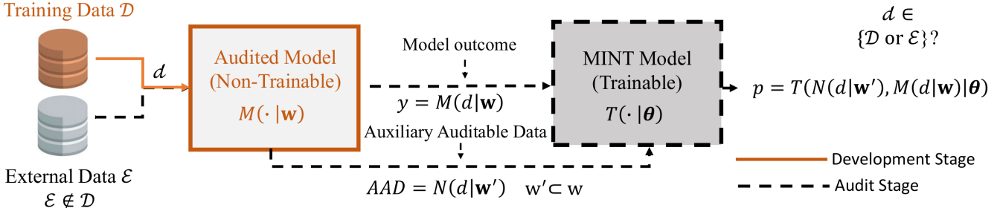

# 📄 A Comprehensive Analysis of Factors Impacting Membership Inference

[CVPR](https://openaccess.thecvf.com/content/CVPR2024W/SAIAD/html/Dealcala_A_Comprehensive_Analysis_of_Factors_Impacting_Membership_Inference_CVPRW_2024_paper.html)

Official repository of the paper:  
**"A Comprehensive Analysis of Factors Impacting Membership Inference"**  
Authors: Daniel Dealcala, Gonzalo Mancera, Aythami Morales, Julian Fierrez, Ruben Tolosana and Javier Ortega-Garcia;  
📅 Date: June 2024  
🧠 Conference/Journal: Accepted at CVPRw

---

## 📝 Abstract

This work analyzes the key factors influencing the effectiveness of Membership Inference Attacks (MIA) and Membership Inference Tests (MINT), two related approaches aimed at detecting whether specific data was used during model training. While both share foundational principles, they differ in their application contexts. We demonstrate that elements such as the number of times a sample is processed during training, the loss function, and the use of dropout substantially affect detection performance. These findings are critical both for improving MINT and for mitigating MIA. Experiments are conducted on the AdaFace facial recognition model using five public datasets totaling over 22 million images. Our study defines a robust evaluation protocol and achieves up to **87% accuracy**, outperforming previous methods and advancing the field of model auditing and privacy assessment.

---

## 🔗 Paper Link

You can read the full paper in **[link](https://openaccess.thecvf.com/content/CVPR2024W/SAIAD/html/Dealcala_A_Comprehensive_Analysis_of_Factors_Impacting_Membership_Inference_CVPRW_2024_paper.html)**.

---

## 📌 Citation

If this paper has been useful to you, please cite our work:

@inproceedings{dealcala2024comprehensive,
  title={A Comprehensive Analysis of Factors Impacting Membership Inference},
  author={DeAlcala, Daniel and Mancera, Gonzalo and Morales, Aythami and Fierrez, Julian and Tolosana, Ruben and Ortega-Garcia, Javier},
  booktitle={Proceedings of the IEEE/CVF Conference on Computer Vision and Pattern Recognition},
  pages={3585--3593},
  year={2024}
}

---

## 📬 Contact

If you have any questions or suggestions, feel free to contact: daniel.dealcala@uam.es

