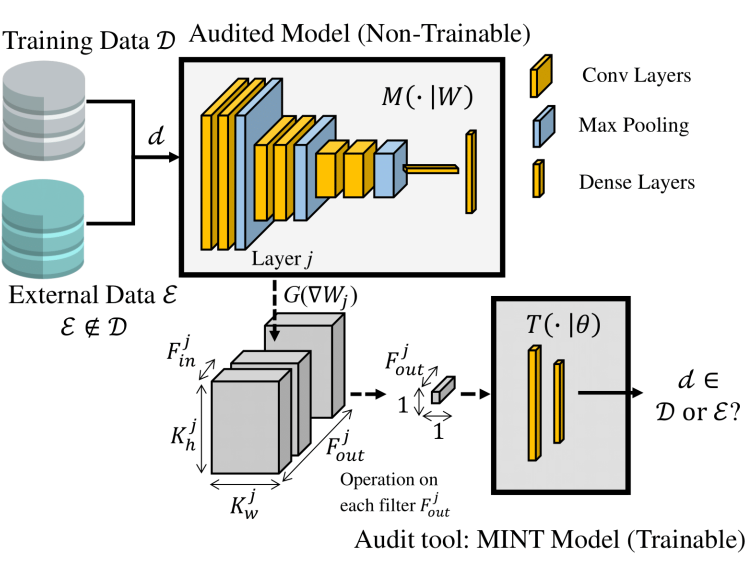

# 📄 gMINT: Gradiant-based Membership Inference Test applied to Image Models.

[CVPR](https://openaccess.thecvf.com/content/CVPR2025W/XAI4CV/html/DeAlcala_gMINT_Gradiant-based_Membership_Inference_Test_applied_to_Image_Models._CVPRW_2025_paper.html)

Official repository of the paper:  
**"gMINT: Gradiant-based Membership Inference Test applied to Image Models."**  
Authors: Daniel DeAlcala, Aythami Morales, Julian Fierrez, Gonzalo Mancera and Ruben Tolosana 
📅 Date: Jun 2025
🧠 Conference/Journal: Presented at CVPRw, journal extension in progress.

---

## 📝 Abstract

**gMINT (Gradient-based Membership Inference Test)** is a novel approach to determine whether specific data was used during the training of a neural network. Instead of relying on activations or outputs, gMINT leverages gradient information — specifically, the **Weight Modifiers**, which represent the updates applied to model weights during training. We explore different types of Weight Modifiers and propose methods to effectively extract and process them. Our experiments span multiple state-of-the-art architectures and four benchmark datasets, achieving **near-perfect detection (up to 100%)** in most cases. These results demonstrate the strong potential of Weight Modifiers as a signal for membership inference, reinforcing the role of gMINT in auditing and privacy assessment of AI systems.

---

## 🔗 Paper Link

You can read the full paper in **[CVPR here](https://openaccess.thecvf.com/content/CVPR2025W/XAI4CV/html/DeAlcala_gMINT_Gradiant-based_Membership_Inference_Test_applied_to_Image_Models._CVPRW_2025_paper.html)**.

---

## 🚀 How to Run the Code

TBD.

**The code will be released upon the journal extension.**

## 📊 Main Results

---

## 📌 Citation

If this paper has been useful to you, please cite our work:

@article{dealcala2024my,
  title={Is my Data in your AI Model? Membership Inference Test with Application to Face Images},
  author={DeAlcala, Daniel and Morales, Aythami and Fierrez, Julian and Mancera, Gonzalo and Tolosana, Ruben and Ortega-Garcia, Javier},
  journal={arXiv preprint arXiv:2402.09225},
  year={2024}
}

---

## 📬 Contact

If you have any questions or suggestions, feel free to contact: daniel.dealcala@uam.es

