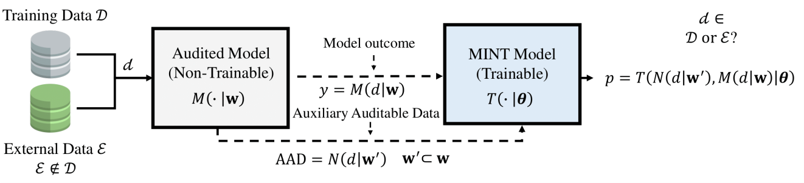

# 📄 Is my Data in your AI Model? Membership Inference Test with Application to Face Images

Official repository of papers:  
**"Is my Data in your AI Model? Membership Inference Test with Application to Face Images"**  
Authors: Daniel DeAlcala, Aythami Morales, Julian Fierrez, Gonzalo Mancera, Ruben Tolosana, and Javier Ortega-Garcia  
📅 Date: Feb 2024
🧠 Conference/Journal: Under Review

**"MINT-Demo: Membership Inference Test Demonstrator"**
Authors: Daniel DeAlcala, Aythami Morales, Julian Fierrez, Gonzalo Mancera, Ruben Tolosana and Ruben Vera-Rodriguez
📅 Date: Feb 2025
🧠 Conference/Journal: CVPR Demo Track and AAAIw.
---

## 📝 Abstract

This repository presents **Membership Inference Test (MINT)**, a new method for empirically assessing whether specific data was used in the training of AI/ML models. We introduce two MINT architectures based on **Multilayer Perceptrons (MLPs)** and **Convolutional Neural Networks (CNNs)**, designed to learn the activation patterns that appear when an Audited Model is exposed to training data. The experiments focus on **Face Recognition**, using six public databases totaling over 22 million face images. Our MINT approach achieves up to **90% accuracy**, demonstrating its potential in determining if specific data was used for training. The method can be valuable for enhancing privacy and fairness in AI applications, such as detecting if sensitive data was used to train or fine-tune models like **Large Language Models (LLMs)**.

---

## 🔗 Paper Link

You can read the full paper in **[arXiv here](https://arxiv.org/abs/2402.09225)**.

---

## 🚀 How to Run the Code

TBD.

**The code will be released upon the article's acceptance.**

## 📊 Main Results

---

## DEMO

we present a MINT platform as demonstrator of this technology aimed to promote transparency in AI training. **[arXiv here](https://arxiv.org/abs/2503.08332)**

This platform allows inference on the models presented in the following papers:**[arXiv here](https://arxiv.org/abs/2503.08332)**, **[arXiv here](https://arxiv.org/abs/2402.09225)**. This platform is focused on promoting transparency. We believe that a tool like this, which allows inference on MINT Models trained on various models (as many as possible, including image, text, video, etc.), would enable users to verify the proper use of their personal data across all models present on the platform and report cases where fundamental rights of citizens have been violated.

You can access the platform directly through the following **[link](https://ai-mintest.org/)**.

## 📌 Citation

If these papers have been useful to you, please cite our work:

@article{dealcala2024my,
  title={Is my Data in your AI Model? Membership Inference Test with Application to Face Images},
  author={DeAlcala, Daniel and Morales, Aythami and Fierrez, Julian and Mancera, Gonzalo and Tolosana, Ruben and Ortega-Garcia, Javier},
  journal={arXiv preprint arXiv:2402.09225},
  year={2024}
}

@article{dealcala2025mint,
  title={MINT-Demo: Membership Inference Test Demonstrator},
  author={DeAlcala, Daniel and Morales, Aythami and Fierrez, Julian and Mancera, Gonzalo and Tolosana, Ruben and Vera-Rodriguez, Ruben},
  journal={arXiv preprint arXiv:2503.08332},
  year={2025}
}

---

## 📬 Contact

If you have any questions or suggestions, feel free to contact: daniel.dealcala@uam.es

